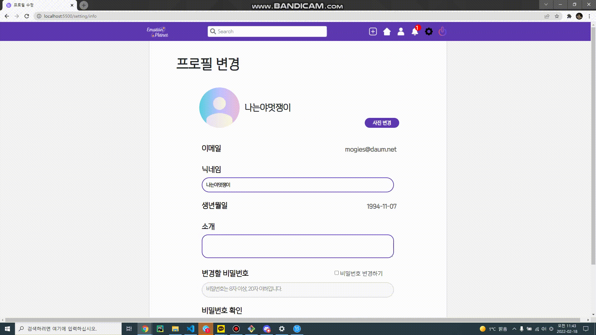

# Emotion Planet

> 마음 속 이야기를 들려줄, 당신만의 작은 우주 :crescent_moon:

## Intro

- 프로젝트명 : **이모션 플래닛(Emotion Planet)**
- 개발 기간: 2022.01.04 ~ 2022.02.18(6 weeks)

- 감정 공유 및 영화/음악/활동 추천 SNS
  - 로그인 시 간단한 감정테스트를 진행
  - 그 날의 감정에 대한 기분 즐기기/기분 전환 두 가지의 컨텐츠(영화, 음악, 활동) 추천을 제공 - TMDB, Spotify API와 자체 데이터 활용
  - 감정 태그(테스트 결과에 따른 자동 할당)와 자유 태그를 활용하여 게시물을 올리고 다른 사용자들과 공유
  - 팔로우, 알림, 댓글 및 좋아요 기능

## Service Flow

### 1. Sign up - Login

▶ 이메일, 닉네임, 전화번호 input event 발생시마다 DB의 데이터와 비교, 유효성 검증 제공을 통해 쾌적한 회원가입 제공

▶ Google OAuth2, Kakao를 이용한 소셜 로그인 제공

▶ 로그인 이후 감정 테스트로 redirect(여섯 가지의 감정 카테고리에서 랜덤 키워드 서버에서 받아와 테스트 진행, 아직 안할래요 버튼 클릭시 메인 페이지로 redirect, '떠돌이 행성' 으로 선택)

### 2. Main - My page

▶ 메인 페이지의 추천 목록은 carousel 형식으로 fit 한 UI 구현, 사용자 편의성 제공

▶ 메인 페이지의 추천 목록에서 찜 목록에 담을 수 있음. 찜 목록은 음악, 영화, 활동 세 카테고리마다 따로 존재

▶ 피드 작성은 네비게이션 바 버튼과 사이드 카드의 버튼으로 사용. 현재 제공된 감정 태그가 자동으로 입력됨. 또한, 해당 감정에서 어떤 활동을 하였는지 한정된 키워드를 통해서 선택 후 작성

### 3. Search - User page

▶ 검색바에 키워드 input event 시 서버에 저장된 게시글, 사용자, 찜 목록 이름과 대조해 결과 제공

▶ 검색 결과를 선택해 해당 페이지로 이동

▶ 유저 페이지에서 해당 유저의 게시글, 찜 목록 조회 가능

### 4. Setting

▶ 사용자 프로필 변경 페이지에서 프로필 이미지, 닉네임, 소개글, 비밀번호 변경 제공

### 5. Additional Features

- 이메일 찾기, 비밀번호 찾기 제공. 비밀번호 찾기 시 데이터 검증 후 해당 이메일로 임시 비밀번호 제공
- 각 기능별 제작된 modal 사용으로 UI 통일성 제공
- WebSocket 연결로 실시간 알림 제공
- 서버측에 요청을 보내는 기능의 경우, access token이 만료되었을 경우 갱신(로그인 시 access token과 refresh token을 반환하여 사용)
- 음악 데이터의 경우 spotify, 영화의 경우 TMDB, 활동의 경우 자체적으로 추가한 데이터 제공
- 감정 테스트 알고리즘은 간단한 키워드 선택의 순서, 갯수별로 점수화하여 결과 도출

## Develop Stack

|  |  |  |  |  |
| -------------------------------- | ------------------------------ | ---------------------------- | ------------------------------ | ------------------------------------ |

+Google Oauth2, JWT, WebSocket

## Collaboration

조은누리: 팀장 / 프론트엔드

임경훈: 프론트엔드 / 디자인 총괄 / UCC 제작

전호정: 프론트엔드

정순일: 백엔드 / Project Manager

최명재: 프론트엔드

최상후: 백엔드 / 서버 관리 및 배포
